.. |box_yes| image:: ../qgis/images/checkbox.png
   :width: 1.5em
.. |npicon| image:: ../qgis/images/np_plugin_icon.png
   :width: 1.5em

Vytvoření zásuvného modulu
--------------------------

Zásuvné moduly, tzv. :wikipedia-en:`pluginy
<Plug-in_(computing)>` představují
doplňkové nástroje. Jejich úlohou je rozšiřovat funkčnost a širokou
škálu použití QGIS. Úvod do této problematiky je součástí
:skoleni:`školení QGIS pro začátečníky
<qgis-zacatecnik/ruzne/qgis_pluginy.html>`, kde se kromě jiného píše,
že v současnosti existuje pro QGIS více než 300 zásuvných modulů
napsaných v programovacím jazyku :wikipedia:`Python` či
:wikipedia:`C++`.

V mnohých případech však může nastat situace, kdy žádný z
existujících zásuvných modulů nesplňuje funkcionalitu jakou bychom
právě potřebovali.  Úroveň rozšiřovaní funkcionality QGIS je různorodá. Za
pomoci jazyka Python může jít o přidání jednoduchého tlačítka až po
tvorbu sofistikovaných nástrojů.

V následující části načrtneme návod jak si vlastní plugin vytvořit a
postup následně odzkoušíme na jednoduchém reálném příkladě. Vytvoříme
zásuvný modul s názvem *Save Views*, který exportuje grafický výstup
ve formě obrázků ve formátu PNG pro každý prvek ve vybrané vektorové
vrstvě do zvoleného výstupního adresáře.

**Užitečné odkazy**

* `PyQGIS Developer Cookbook <http://docs.qgis.org/testing/en/docs/pyqgis_developer_cookbook>`_
* `QGIS API <http://qgis.org/api>`_

Potřebné nástroje
=================

I. Qt Creator
^^^^^^^^^^^^^

Pro tvorbu nového pluginu budeme potřebovat :wikipedia-en:`Qt
Creator`, což je aplikace vývojového frameworku s názvem
:wikipedia:`Qt <Qt (knihovna)>`.  Tento nástroj, resp. jeho součást
*Qt Designer*, využijeme pro tvorbu uživatelského rozhraní nového
modulu.

II. Python rozhraní pro Qt
^^^^^^^^^^^^^^^^^^^^^^^^^^

Vzhledem k tomu, že budeme vyvíjet plugin v programovacím jazyku
Python, musíme nainstalovat Python rozhraní, angl. Python
:wikipedia-en:`bindings <Language binding>` pro Qt. Pro tvorbu zásuvných
modulů je potřeba ``pyrcc4``.

.. note:: Způsob instalace se v tomto případě liší podle platformy.
          Na Windows je možné stáhnout instalátor `OSGeo4W
          <http://trac.osgeo.org/osgeo4w/>`_, vybrat volbu *Express
          Desktop* a nainstalovat balík *QGIS*. Po instalaci je
          nástroj ``pyrcc4`` dostupný v rámci *OSGeo4W Shell*.  Na Mac
          OS je potřeba nainstalovat správce balíčků `Homebrew
          <http://brew.sh>`_ a doinstalovat balíček *PyQt*.  V případě
          Linuxu jde o balíček *python-qt4*. V Ubuntu jej
          např. nainstalujeme příkazem ``sudo apt-get install
          python-qt4``.

III. Textový editor
^^^^^^^^^^^^^^^^^^^

Vhodný textový editor anebo integrované vývojové prostředí
(:wikipedia:`IDE <Vývojové prostředí>`) jsou pro psaní zdrojového kódu
důležité. Mezi oblíbené editory patří například *Sublime Text, Vim,
Emacs, Notepad++, TextWrangler, IDLE, Atom, Aquamacs, GNU Nano, Kate,
gedit*, prostředí *Spyder* či *PyCharm* a podobně.

IV. Zásuvný modul Plugin Builder
^^^^^^^^^^^^^^^^^^^^^^^^^^^^^^^^

Tento velmi užitečný zásuvný modul do QGISu nám pomůže vytvořit
všechny potřebné soubory a standardní podobu kódu pro budoucí
plugin. Nainstalujeme jej klasickým způsobem pomocí správce zásuvných
modulů v QGISu, viz. :skoleni:`školení QGIS pro začátečníky
<qgis-zacatecnik/ruzne/qgis_pluginy.html>`.

V. Zásuvný modul Reloader plugin
^^^^^^^^^^^^^^^^^^^^^^^^^^^^^^^^
   
Díky tomuto pluginu nemusíme při každé změně kódu restartovat
QGIS. Změny se projeví ihned po jeho spuštění. Nainstalujeme jej
klasickým způsobem pomocí správce zásuvných modulů v QGISu (pro jeho
instalaci je potřeba povolit *experimentální* moduly v nastavení
správce).

Pět základních kroků pro vytvoření pluginu Save Views
=====================================================

:ref:`1.<krok1>` 
Vytvoření šablony nového pluginu pomocí zásuvného modulu *Plugin Builder*

:ref:`2.<krok2>` 
Kompilace zdrojových kódů spojených s novým pluginem

:ref:`3.<krok3>` 
Načtení nového pluginu ve správci zásuvných modulů

:ref:`4.<krok4>` 
Vytvoření uživatelského rozhraní pomocí Qt Creator / Designer

:ref:`5.<krok5>` 
Implementace funkcionality pluginu v rámci Python kódu

.. _krok1:

1. Vytvoření šablony nového pluginu
^^^^^^^^^^^^^^^^^^^^^^^^^^^^^^^^^^^

Po spuštění zásuvného modulu pro tvorbu pluginů se objeví dialogové
okno, kde zadáme základní údaje o našem novém nástroji,
viz. :num:`#plugin-builder`.  Na další stránce průvodce vyplníme
podrobné informace o našem nástroji (*About*). V třetí části vybereme
šablonu uživatelského prostředí, v našem případě `Tool button with
dialog`, zadáme text, který se bude zobrazovat v menu. Nakonec
vybereme, pod kterou položkou v menu náš nový plugin uživatel najde,
například `Vector`.  Na dalších stránkách průvodce je možné ovlivnit
vytvoření dalších podpůrných souborů, vyplnit povinné a volitelné
informace, například domovskou stránku, repositář modulu se zdrojovými
kódy, označit nástroj jako experimentální a podobně.

.. _plugin-builder:

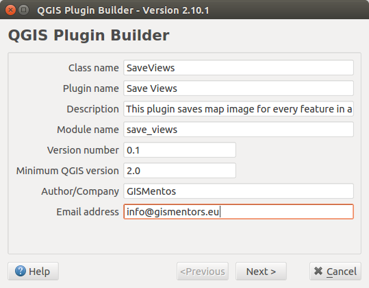

   Dialogové okno zásuvného modulu na tvorbu pluginů.

Následně se objeví okno, kde je potřebné zadat cestu do kterého
adresář s nástrojem uložíme (:num:`#plugin-dir`). Obvykle to je
:file:`.qgis2/python/plugins` umístěný v domovském adresáři uživatele. Jeho
umístění se liší v závislosti na platformě.

.. _plugin-dir:

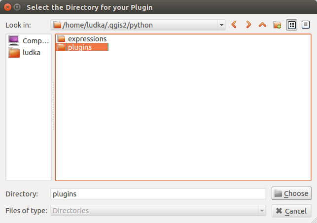

   Adresář obsahující všechny nainstalované zásuvné moduly QGIS.

Po tomto kroku se objeví potvrzující dialog, tzv. `Plugin Builder
Results` obsahující souhrnné informace.

.. _krok2:

2. Kompilace
^^^^^^^^^^^^

Přepneme se do adresáře, kde byl plugin SaveViews vytvořen. Pod
Linuxem například pomocí příkazu ``cd
.qgis2/python/plugins/SaveViews`` a spustíme ``make``. Tento příkaz
kompiluje tzv. *Resource Collection File* (`*.qrc`). Jde vlastně o
spuštění výše uvedeného ``pyrcc4``.

.. _krok3:

3. Načtení nového pluginu ve správci zásuvných modulů
^^^^^^^^^^^^^^^^^^^^^^^^^^^^^^^^^^^^^^^^^^^^^^^^^^^^^

Po restartu QGISu by měl být v sekci :menuselection:`Zásuvné moduly
--> Spravovat a instalovat zásuvné moduly` viditelný i plugin *Save
Views*. Zaškrtnutím |box_yes| se objeví jeho ikona |npicon| v hlavní
liště tak jako jsme zadali, tj. v sekci `Vector`.
(:num:`#plugin-menu`).

.. _plugin-menu:

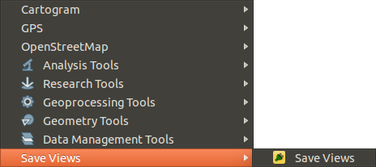

   Nový plugin dostupný pod položkou *Vector*.

Spuštěním otevřeme dialog nástroje, který obsahuje tlačítka ``Cancel``
a ``OK`` (:num:`#plugin-dlg`).

.. _plugin-dlg:

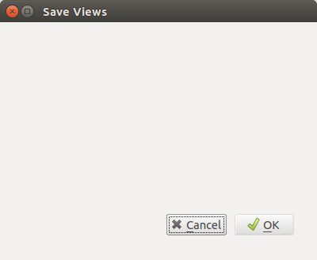

   Dialogové okno modulu *Save Views* po prvním spuštění.

.. tip::

   V této fázi je dobré se zamyslet nad funkcionalitou pluginu, jaký
   bude typ vstupních dat a podobně. Na základě našich požadavků je
   vhodné si vytvořit testovací sadu.

Vytvoříme si jednoduchý projekt v QGISu, který bude obsahovat několik
vektorových vrstev. Na :num:`#np-project` jsou zobrazeny například
požární stanice, železnice, kraje, velkoplošné území a státní
hranice České republiky.

.. _np-project:

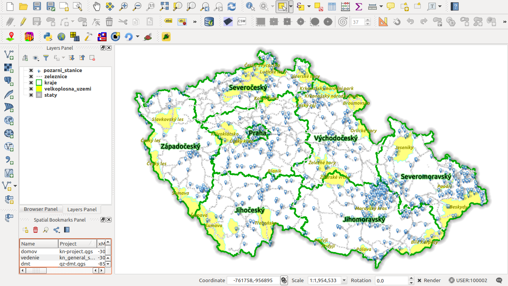

   Příklad projektu s vektorovými vrstvami v QGIS.

.. _krok4:

4. Vytvoření uživatelského rozhraní pomocí Qt Creator
^^^^^^^^^^^^^^^^^^^^^^^^^^^^^^^^^^^^^^^^^^^^^^^^^^^^^

Vzhled a elementy dialogového okna pluginu budeme upravovat v programu
*Qt Creator / Designer*. V hlavní liště zvolíme :menuselection:`File
--> Open File or Project` a otevřeme soubor s příponou `*.ui`. V našem
případě `save_views_dialog_base.ui`, který najdeme v adresáři
vytvořeného pluginu. Na :num:`#qtcreator` je znázorněné prozatím
prázdné okno s objekty (tzv. widgety) `SaveViewsDialogBase` a
`button_box`. Pomocí metody `drag-and-drop` je možné z levého panelu přidávat
další objekty a jejich názvy a vlastnosti měnit v pravé části okna
aplikace *Qt Creator / Designer*.

.. _qtcreator:

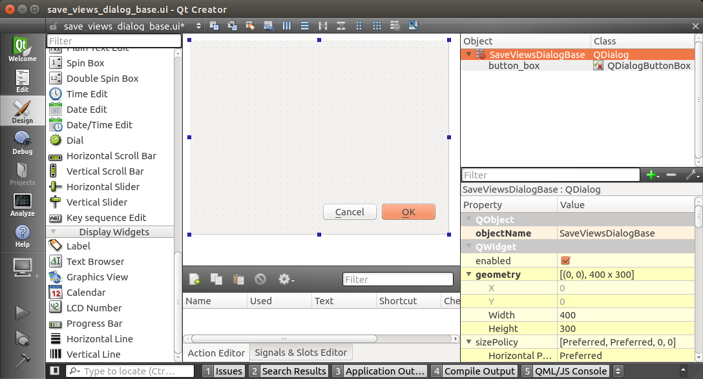

   Dialogové okno vytvářeného pluginu v prostředí aplikace *Qt Creator*.

První dva objekty (widgety), které přidáme budou tzv. *Combo Box* z
kategorie *Input Widgets* a *Label* z kategorie *Display
Widgets*. V pravém panelu předvolený text objektu *label* změníme na
`Select a layer` (:num:`#qtlabel`).

.. _qtlabel:

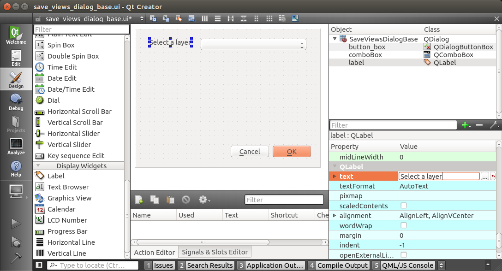

   Editace objektů dialogového okna.

Po uložení :menuselection:`File --> Save` přejdeme do prostředí QGIS,
kde použijeme plugin *Plugin Reloader*. V `Choose a plugin to be
reloaded` nastavíme `SaveViews` (:num:`#qt-plugin-reloader`) a plugin
spustíme. Tím se aktualizuje podoba našeho pluginu. Po kliknutí na
ikonu `Save Views` se otevře okno totožné s návrhem na
:num:`#qtlabel`.

.. _qt-plugin-reloader:

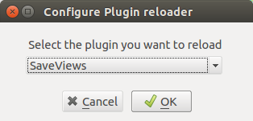

   Konfigurace zásuvného modulu *Plugin Reloader*.

.. _krok5:

5. Implementace funkcionality nástroje a další úpravy
^^^^^^^^^^^^^^^^^^^^^^^^^^^^^^^^^^^^^^^^^^^^^^^^^^^^^

Řekněme, že chceme, aby se po spuštění pluginu *Combo Box* automaticky
naplnil vektorovými vrstvami aktuálního projektu. Hlavním souborem,
který se stará o logiku jednotlivých objektů, je v našem případě
`save_views.py`. Otevřeme jej v textovém editoru a najdeme metodu
`run`.  Tato metoda se spouští při každém startu pluginu. Do jejího těla (:num:`#np-run-method`) umístíme následující kód.

.. code::

	# populate the Combo Box with the layers loaded in QGIS
        self.dlg.comboBox.clear()
        layers = self.iface.legendInterface().layers()
        layer_list = []
        for layer in layers:
            layer_list.append(layer.name())
        self.dlg.comboBox.addItems(layer_list)

.. _np-run-method:

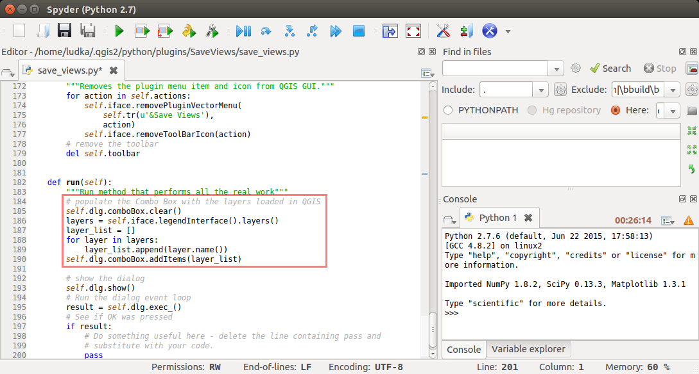

   Editace kódu v jazyku Python s cílem naplnit *Combo Box*
   vektorovými vrstvami.

Na :num:`#np-cb-filled` je vidět, že po restartu a novém spuštění
*Save Views* se změny úspěšně projeví.

.. _np-cb-filled:

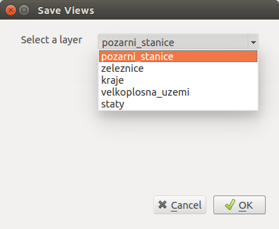

   Vzhled dialogového okna po změnách ve zdrojovém kódu.

Obdobně vložíme do okna další elementy a přiřadíme jim příslušnou
funkcionalitu. Kromě popisu `Select output directory` půjde o objekty
`Line Edit` a `Tool Button`.  Pro `button_box` ve vlastnostech změníme
tlačítko ``OK`` na ``Save All``, nastavíme přiměřené rozměry pro každý
element a upravený soubor `*.ui` uložíme.  Důležité jsou názvy
jednotlivých objektů, viz. :num:`#np-final-dlg`, budeme je ještě
potřebovat.

.. _np-final-dlg:

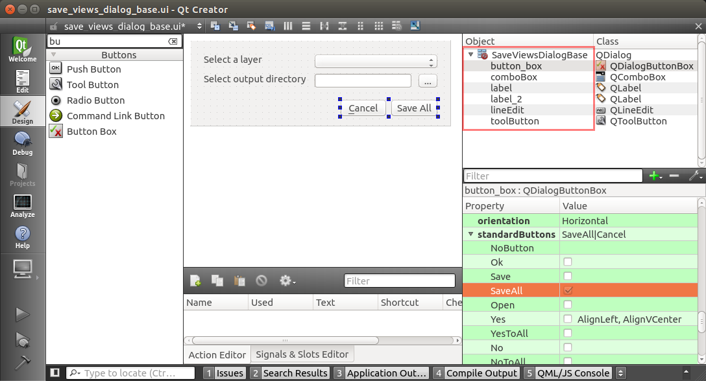

   Finální návrh dialogového okna pluginu *Save Views*.

.. note:: Pokud je uživatelské rozhraní definováno více objekty
	  (widgety) je vhodné je rozumně pojmenovat. V případě našeho
	  jednoduchého modulu si vystačíme s předvolenými názvy.

V dalším kroku opět editujeme soubor `save_views.py`. Potřebujeme
přidat kód, který zabezpečí, aby se po kliknutí na tlačítko ``...``
otevřel dialog, ve kterém zvolíme adresář pro uložení výsledných
obrazových souborů pro každý prvek ve vybrané vektorové vrstvě.
O tuto funkcionalitu se postará metoda
``select_output_directory()``. Přidáme ji například nad metodu ``run()``
(:num:`#select-output-dir`).

.. code::

	# open directory browser and populate the line edit widget 
    	def select_output_dir(self):
	    self.dirname = QFileDialog.getExistingDirectory(self.dlg, "Select directory ","/home")
            self.dlg.lineEdit.setText(self.dirname)

.. _select-output-dir:

.. figure:: images/np_select_output_dir.png
   :class: middle

   Metoda, která otevře dialog pro výběr výstupního adresáře.
 
Do sekce ``import`` na začátek souboru je nutné přidat `QFileDialog`
jako ``from PyQt4.QtGui import QAction, QIcon, QFileDialog``. Následně
propojíme metodu ``select_output_dir()`` s tlačítkem *toolButton*
(tlačítko ``...``) přidáním těchto řádků do metody ``__init__()``.  Soubor
uložíme, plugin restartujeme a vyzkoušíme (:num:`#np-skuska-1`).

.. code::

	# clear the previously loaded text (if any) in the line edit widget 
        self.dlg.lineEdit.clear()
	# connect the select_output_file method to the clicked signal of the tool button widget
        self.dlg.toolButton.clicked.connect(self.select_output_dir)

.. _np-skuska-1:

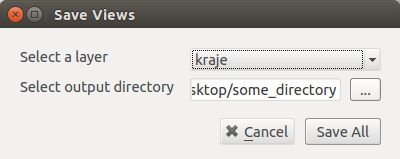

   Načtení adresáře pro grafické výstupy pomocí nového pluginu.

Posledním krokem je změnit to, aby se po kliknutí na tlačítko `Save
all` opravdu provedlo, co chceme. Začneme importem `QColor` a
`QPixmap`. Vytvoříme novou metodu ``save_views()``. Potom vyhledáme
metodu ``run()`` a najdeme řádek obsahující ``pass``. Ten nahradíme
volání této funkce.

.. code::

       def save_views(self, layers):
            # save graphical output for every row in attribute table
            selectedLayerIndex = self.dlg.comboBox.currentIndex()
            selectedLayerName = self.dlg.comboBox.currentText()
            selectedLayer = layers[selectedLayerIndex]

            frame_count = selectedLayer.dataProvider().featureCount()

            if frame_count <= 1:
                print "Layer must have more than one feature!"
            else:               
                for feature in range(int(frame_count)):
                    selection = [int(feature)]
                    selectedLayer.setSelectedFeatures(selection)
                    self.iface.mapCanvas().setSelectionColor(QColor("transparent"));
                    box = selectedLayer.boundingBoxOfSelected()
                    self.iface.mapCanvas().setExtent(box)
                    pixmap = QPixmap(self.iface.mapCanvas().mapSettings().outputSize().width(),
                    self.iface.mapCanvas().mapSettings().outputSize().height())
                    mapfile = self.dirname + "/" + selectedLayerName + "_" + format(feature, "03d") + ".png"
                    self.iface.mapCanvas().saveAsImage(mapfile, pixmap)
                    selectedLayer.removeSelection()

                # save also full extend of vector layer                            
                canvas = self.iface.mapCanvas()
                canvas.setExtent(selectedLayer.extent())
                pixmap = QPixmap(self.iface.mapCanvas().mapSettings().outputSize().width(),
                self.iface.mapCanvas().mapSettings().outputSize().height())
                mapfile = self.dirname + "/" + selectedLayerName + "_full" + ".png"
                self.iface.mapCanvas().saveAsImage(mapfile, pixmap) 

.. _np-run-code:

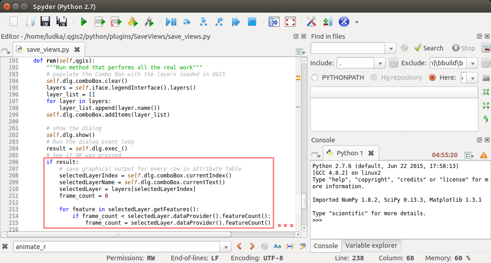

   Doplnění kódu do metody *run()*.

Grafické výstupy po aplikovaní na vrstvu krajů jsou zobrazeny na
:num:`#np-plugin-result`. Jejich názvy v adresáři závisí na názvu
konkrétní vektorové vrstvy. Liší se pouze pořadovým číslem. Kompletní
obsah výsledného souboru `save_views.py` je uvedený níže.

.. _np-plugin-result:

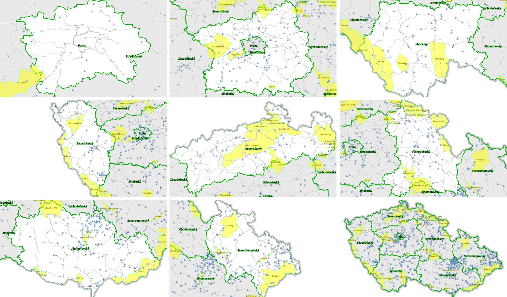

   Grafické soubory uložené ve zvoleném adresáři pro vektorovou vrstvu
   krajů České republiky.

.. tip::

	V případě, že chceme změnit ikonu, stačí nový soubor s
	ikonkou, např.  :num:`#np-new-icon`, uložit do adresáře
	:file:`~/.qgis2/python/plugins/SaveViews` jako soubor
	`icon.png` a spustit příkaz ``make clean && make`` v příkazové
	řádce. Nakonec restartujeme plugin pomocí modulu *Plugin
	Reloader*.

	.. _np-new-icon:

	.. figure:: images/np_new_icon.png
   	   :scale: 15%

	   Příklad nové ikonky

Výsledný soubor ``save_views.py`` je ke stažení také `zde
<../_static/skripty/save_views.py>`_.
           
.. literalinclude:: ../_static/skripty/save_views.py
   :language: python
   :linenos:
           
Jiný příklad využití
^^^^^^^^^^^^^^^^^^^^

Na obrázku :num:`#np-kn-project` je uveden projekt s katastrálními
daty. Vyznačené jsou parcely, přes které budou procházet plánované
inženýrské sítě.

.. _np-kn-project:

.. figure:: images/np_kn_project.png
   :class: middle

   Znázornění parcel přes které májí procházet plánované inženýrské
   sítě.

Použitím pluginu `Save Views` můžeme pro každého vlastníka vyhodnotit
grafické znázornění jeho parcely, na které bude zapsané věcné břemeno
(:num:`#np-kn-project-views`).

.. _np-kn-project-views:

.. figure:: images/np_kn_project_views.png
   :class: middle

   Pohled na každou parcelu jako výsledek zásuvného modulu *Save Views*.

